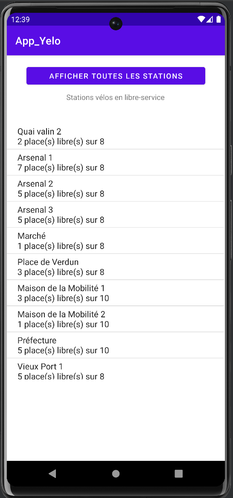
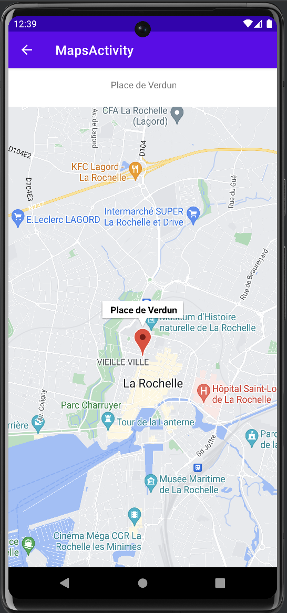

# Application Yelo La Rochelle

This application, produced as part of an evaluation during my university course, is an application linked to a self-service bicycle service.

This, based on the API made available by the company Yelo, allows you to display the list of all the stations across La Rochelle. 
For each station, it is indicated its name as well as the number of places available to deposit a bicycle.
When clicking on a station, a map opens with a marker indicating the position of the station.

**Documentation of the API [here](https://opendata.agglo-larochelle.fr/api/doc "API Yelo").**

# Some screenshots

    
    

